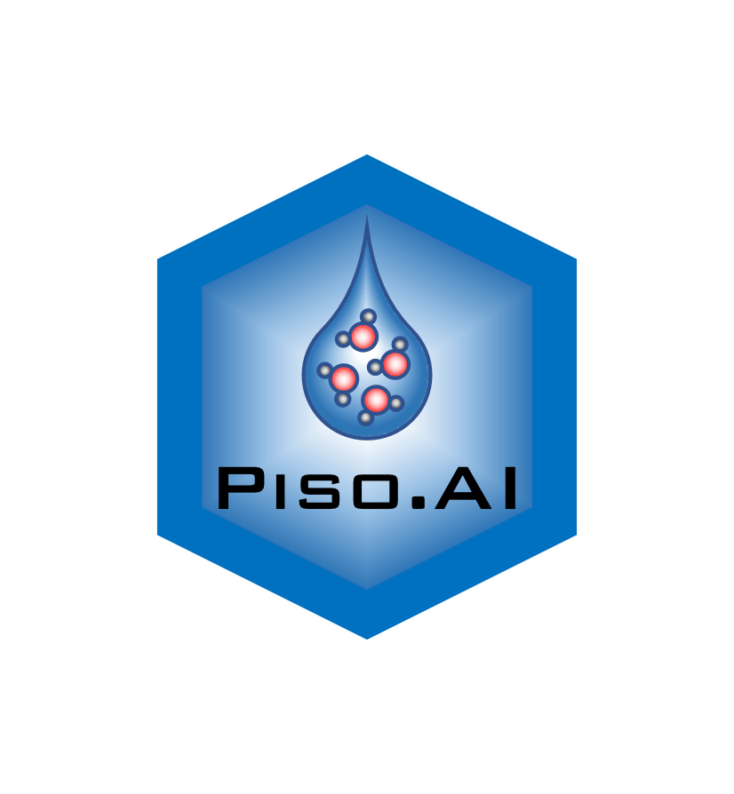

# Piso.AI 
[Piso.AI](https://isotope.bot.unibas.ch/PisoAI/ "Piso.AI website") is a tool for predicting monthly timeseries of oxygen and hydrogen isotope values of precipitation that uses a machine learning model trained on geographic and climate data. Point predictions based on the model can be accessed here using the web interface [https://isotope.bot.unibas.ch/PisoAI/](https://isotope.bot.unibas.ch/PisoAI/ "Piso.AI website")

This repository contains all of the R code detailing the processing of input data and training of model used for the creation of the operational [Piso.AI](https://isotope.bot.unibas.ch/PisoAI/ "Piso.AI website") model/dataset, released as:


[Nelson DB, Basler D, Kahmen A (2021) Precipitation Isotope Time Series Predictions from Machine Learning Applied in Europe.
PNAS 2021 Vol. 118 No. 26 e2024107118](https://www.pnas.org/content/118/26/e2024107118 "publication")
```
```

## Overview of R files and folders
* `0-file_paths.R` Edit this file to adjust paths for data and other external resources
* `/compile spatial data` This folder contains various functions that are used to extract data from the input predictor variable datasets
* `1-GNIP-model_dataprep.R`  This script reads all input data and performs the splitting into train, test, and watch data
* `/d2H`, `/d18O`,  `/dxs` These folders contains the code to train the models for d2H, d18O, and dxs. Each folder contains three scripts: 
	* `[target]-1-GNIP-model-train.R` (full model) using the full set of predictor variables
	* `[target]-2-GNIP-model-train.R` (simplified model) using a restricted set of predictors, i.e. the top 90 % of predictors from all 3 initial models for each target (d2H, d18O, and dxs) - these d2H and d18O models are the ones used by the web interface
	* `[target]-3-GNIP-model-train.R` (linked model) similar predictors as in model 2, except that the d2H and d18O models 3 also included the model 2 dxs predictions as a predictor, and the dxs model 3 included the model 2 d2H and d18O predictions as predictors. 

* `2-GNIP-model-simplify.R` This script compiles the importance score of model 1 to prepare the training of the simplified model 2
* `3-GNIP-model-simplify.R` This script compiles the predictions of  model 2 to prepare the training of the linked model 3
* `4-GNIP-model-compile.R` This the compiles the predictions of model 1, model 2, model 3 and prepares the final output table
* `5-transformFF.R` transform required input predictors to ff objects for use with Piso.AI online application

Keep in mind that some of the scripts will take a significant amount of time to finish.

## Prerequisites
 The following data and tools have to be present on your system to use the code provided here.

#### Data

The following datasets have to be downloaded from data providers. The required files are not linked directly, to adhere to the different providers' data sharing policy. Some providers request to register before downloading data.

* [GNIP dataset](https://www.iaea.org/services/networks/gnip)
* [CRU dataset](http://www.cru.uea.ac.uk/data)
* [E-OBS dataset](https://www.ecad.eu)
* [NCEP Reanalysis data](https://www.esrl.noaa.gov/psd/)
* [CPC teleconnections dataset](https://www.cpc.ncep.noaa.gov/data/teledoc/telecontents.shtml)
* [USGS GTOPO30 DEM](https://www.usgs.gov/centers/eros/science/usgs-eros-archive-digital-elevation-global-30-arc-second-elevation-gtopo30?qt-science_center_objects=0#qt-science_center_objects)


#### Tools
* [CDO Tools](https://code.mpimet.mpg.de/projects/cdo/) CDO (Climate Data Operators) is a collection of command-line operators to manipulate and analyze climate and forecast model data.

#### R libraries

The required R libraries are listed below. The snippet can be used to install missing libraries. 
```R
list.of.packages <- c("abind","caret","data.table","dplyr","ff","ggplot2","lubridate","ncdf4","raster","reshape2","rsample","rts","xgboost")
new.packages <- list.of.packages[!(list.of.packages %in% installed.packages()[,"Package"])]
if(length(new.packages)) install.packages(new.packages)
```

## Online access to model predictions
Besides the web interface [web interface](https://isotope.bot.unibas.ch/PisoAI/ "Piso.AI website"), point predictions can also be requested through the PisoAI API by providing the following parameters:

* `lat` (required) latitude in decimal degrees
* `lon`  (required) longitude in decimal degrees
* `site`   (optional) site identifier (default: `PisoAI site`)
* `from` (optional) startdate  in YYYY-MM-DD format (default: `1950-01-01`) 
* `to`      (optional) enddate  in YYYY-MM-DD format (default: `2019-12-31`)
* `elevation` (optional) elevation in meters (default: elevation extracted from DEM)

Parameters are passed using standard url encoding, e.g. 
```
curl "http://isotope.bot.unibas.ch/PisoAI/api?site=BSL&lat=45.7&lon=7.6"
```

## Acknowledgements

This project has received funding from the European Research Council (ERC) under the European Union’s Horizon 2020 research and innovation programme (grant agreement No 724750).
